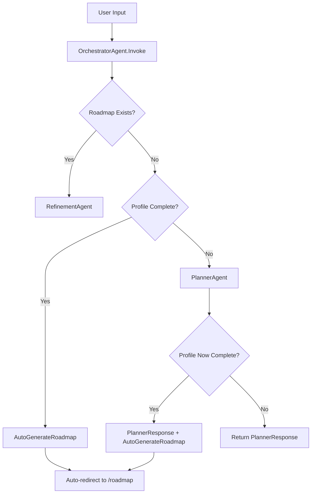

# OrchestratorAgent Automatic Workflow Implementation

## ✅ **CORRECTED: Automatic Roadmap Generation**

### **🎯 Problem Identified:**
You were absolutely right! The OrchestratorAgent was designed to be the main decision maker but wasn't being used properly. The previous flow required manual user intervention (clicking a button) to generate the roadmap, which defeats the purpose of having an intelligent orchestrator.

## **Fixed Workflow:**

### **❌ Previous Flow (Manual):**
```
1. User converses with PlannerAgent
2. Profile becomes complete
3. System shows "Generate Roadmap" button  
4. User clicks button manually ← Wrong!
5. Roadmap generated
```

### **✅ New Flow (Automatic):**
```
1. User converses with OrchestratorAgent
2. OrchestratorAgent delegates to PlannerAgent for profile building
3. When profile is sufficient → OrchestratorAgent automatically generates roadmap
4. User gets notified → Automatic redirect to roadmap view
```

## **Technical Implementation:**

### **🔧 OrchestratorAgent Enhanced:**

#### **Smart Decision Logic:**
```csharp
public async Task<string> Invoke(string input)
{
    // Check if we have a roadmap already - handle refinement
    var existingRoadmap = _roadmapStateService.CurrentRoadmap;
    if (existingRoadmap != null)
    {
        return await _refinementAgent.Invoke($"Roadmap: {roadmap}\nUser Feedback: {input}");
    }

    // Profile complete but no roadmap - generate automatically  
    if (_userProfileService.IsProfileSufficient())
    {
        return await AutoGenerateRoadmap();
    }
    
    // Profile incomplete - continue planning
    var plannerResponse = await _plannerAgent.Invoke(input);
    
    // Check if profile just became complete - auto-generate
    if (_userProfileService.IsProfileSufficient())
    {
        var roadmapMessage = await AutoGenerateRoadmap();
        return plannerResponse + "\n\n" + roadmapMessage;
    }
    
    return plannerResponse;
}
```

#### **Automatic Roadmap Generation:**
```csharp
private async Task<string> AutoGenerateRoadmap()
{
    var roadmap = await GenerateRoadmap(); // Creates and stores roadmap
    
    return "🎉 Perfect! I have all the information I need. Let me create your personalized learning roadmap now...\n\n" +
           "📋 Generating your roadmap based on:\n" +
           $"• Learning Goal: {roadmap.UserProfile?.LearningGoal}\n" +
           $"• Experience Level: {roadmap.UserProfile?.ExperienceLevel}\n" +
           "✨ Your personalized learning roadmap has been successfully generated!";
}
```

### **🎯 Updated System Message:**
```
AUTOMATIC WORKFLOW:
- During profile gathering: Direct interactions through PlannerAgent
- When profile is sufficient: AUTOMATICALLY proceed to roadmap generation
- After roadmap generation: Handle refinement requests

DECISION LOGIC:
- If profile is incomplete: Continue with PlannerAgent
- If profile is complete BUT no roadmap exists: Generate roadmap automatically
- If roadmap exists: Handle refinement requests

Never ask the user to click buttons - handle everything automatically through conversation.
```

### **🖥️ UI Simplified:**
- **Removed**: Manual "Generate Roadmap" button
- **Removed**: `GenerateRoadmap()` method in Home.razor
- **Enhanced**: Automatic detection of roadmap completion
- **Auto-redirect**: Navigates to roadmap view automatically

## **Workflow States:**

### **State 1: Profile Building**
```
User: "I want to learn React"
OrchestratorAgent → PlannerAgent: "What's your experience level?"
User: "Beginner" 
OrchestratorAgent → PlannerAgent: "What programming languages do you know?"
...continuing until profile is sufficient
```

### **State 2: Automatic Transition**
```
When UserProfileService.IsProfileSufficient() == true:
OrchestratorAgent automatically:
1. Calls StructuringAgent → Creates learning framework  
2. Calls ResearchAgent → Finds curated resources
3. Stores roadmap in RoadmapStateService
4. Notifies user with summary and auto-redirects
```

### **State 3: Refinement Mode**
```
User: "Can you add more advanced JavaScript topics?"
OrchestratorAgent → RefinementAgent: Modifies existing roadmap
Returns refined roadmap
```

## **Benefits of Automatic Workflow:**

### **🎯 Seamless User Experience:**
- No manual button clicking required
- Intelligent conversation flow
- Automatic progression from planning to roadmap generation

### **🤖 True AI Orchestration:**
- OrchestratorAgent makes all decisions
- User focuses on conversation, not UI interactions  
- Smart state management between agents

### **📊 Simplified Architecture:**
- Home.razor focuses on conversation display
- All logic centralized in OrchestratorAgent
- Clear separation of concerns

## **Decision Flow:**



## **Key Changes Made:**

### **✅ OrchestratorAgent.cs:**
- Enhanced `Invoke()` method with automatic decision logic
- Added `AutoGenerateRoadmap()` method for seamless generation
- Updated system message for automatic workflow
- Added RoadmapStateService injection for state management

### **✅ Home.razor:**
- Removed manual "Generate Roadmap" button and method
- Enhanced `CheckIfProfileComplete()` to detect roadmap generation
- Added automatic redirect to roadmap view
- Simplified conversation-focused UI

### **✅ Build Status:** ✅ **SUCCESS**
- All compilation errors fixed
- Proper dependency injection
- Clean separation of concerns

---

## **🎉 Result: True AI Orchestration!**

The OrchestratorAgent now truly orchestrates the entire workflow:

- **✅ Intelligent Decision Making**: Automatically determines next steps
- **✅ Seamless Transitions**: Profile building → Roadmap generation → Refinement
- **✅ No Manual Intervention**: Everything happens through natural conversation
- **✅ Proper State Management**: Knows when to generate, refine, or continue planning
- **✅ User-Focused**: User converses, AI handles all complexity

**The OrchestratorAgent is now the single point of control that manages the entire learning roadmap creation process automatically!** 🚀